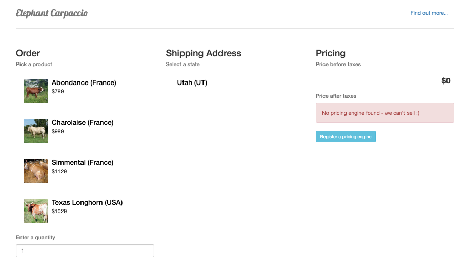
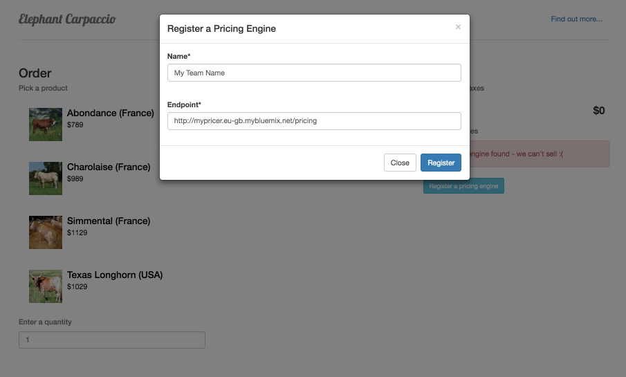

# Elephant Carpaccio - sample pricing engine in nodejs

Introduce the game

## The pricing engine

* This repository implements an empty pricing engine.
* It provides a starting point for the exercise.
* It displays the engine specification and a simple user interface to submit values to the engine

## Deploying the pricing engine on Bluemix

In this section, you will create your Bluemix account, deploy an empty pricing engine written in nodejs, use Bluemix DevOps web editor to modify the engine implementation and deploy your changes and finally connect your pricing engine to the main store.

1. Go to [ibm.com/bluemix](http://ibm.com/bluemix) and click Sign Up

  

1. Fill out and submit your information

  
  
  
  
  

1. Wait for the activation link in your emails
  
  
  
1. Go to [ibm.com/bluemix](http://ibm.com/bluemix) and Log in

  

  Once logged, the Bluemix console is shown on the dashboard:  
  
  
  
1. Push the deploy button below:

  <a href="https://bluemix.net/deploy?repository=https://github.com/l2fprod/carpaccio-pricing" target="_blank"></a>

1. Click "Log In" to connect to Bluemix DevOps

  
  
1. If you never connected to Bluemix DevOps before, you will be prompted to define an alias to be used by DevOps services

  

  
  
1. From here you will be taken to a page, where you will be prompted to name your pricing engine. A sample name is provided for you, but feel free to give your application any name you like (if the name is taken by another user, you will be prompted to try another name).

  **Note:** You can keep the default settings for Region, Organization and Space.

  

1. Once you have named your application, click the Deploy button to begin the deploy process to IBM Bluemix. During this process, IBM Bluemix will automatically build and deploy our application based on the GitHub repository.

  
  
1. Once the application has finished deploying, you will see a **Success!** message.

  

  The process has created a new private DevOps Services project, a git clone of the lab source code repository, built your application and deployed it to IBM Bluemix. In addition, it configured a Build & Deploy pipeline that will get triggered whenever your commit changes to the Git repository.

1. Click **View Your App** to access the deployed application

  
  
1. We are now going to perform changes to the running application. Back to the "Deploy to Bluemix" page, click **Edit Code**

  
  
1. This opens the Web Editor on your app

  
  
  The web editor allows to modify and commit changes to the project without leaving your web browser.
  It comes with a **Live Edit** feature allowing to modify the changes to the running app without having to commit the changes to the code to the Git repository. We will enable and use this feature in the next steps to accelerate the round trip between changing the code and viewing the impact of the change on the deployed app.
  
1. Enable **Live Edit** by clicking on the switch
  
  
  
1. Click **OK** when prompted

  
  
1. Wait until **Live Edit** is enabled for the app. Notice the indicator near the project name shows the status of enabling Live Edit for your app

  
  
1. After a short while, the project indicator becomes green again. **Live Edit** is enabled.

  
  
1. Open the file **app.js** which contains the pricing engine implementation

  

1. Line 23 shows the implementation of the /pricing endpoint. Currently it returns a 501 error code (Not Implemented)

  
  
1. To illustrate the **Live Edit** feature, let's modify the implementation. Instead of simply returning the error code, we will also add a message.

  The new code reads as:
  ```
  res.status(501).send({error: "this is not implemented"})
  ```

  Once modified, click the "Restart the App Without Redeploying" button
  
  
  
1. Let's do another change, this time we show a dummy implementation return 0 as the totalPrice for the transaction

  ```
  res.send({totalPrice: 0})
  ```

  
  
  Once modified, click the "Restart the App Without Redeploying" button
  
1. Testing the change

  
  
  At this point you are equipped to perform quick changes to your app and to have them taken into account by the store.
  
1. To register your pricing engine with the store, on the store homepage, click **Register a pricing engine**

  
  
1. Enter your engine information and click **Register**

  
  
  

### Committing changes to the main repository

Up to this point, all the changes you made are local to the web editor and have not been committed to the Git repository for your project.

1. To commit the changes made in the web editor, switch to the Git view

  
  
1. Select the changes to commit

  

1. Type a message and click Commit

  
  
1. To push the changes from the web editor Git repository to the master Git repository, use the Sync button

  
  
    
  
  
    
## Running the pricing engine on Bluemix

Use this section if you want to use your local development environment to develop and deploy your application.

1. Create a Bluemix Account

    [Sign up][bluemix_signup_url] for Bluemix, or use an existing account.
    
2. Download and install the [Cloud-foundry CLI][cloud_foundry_url] tool

3. Clone the app to your local environment from your terminal using the following command

  ```
  git clone https://github.com/l2fprod/carpaccio-pricing.git
  ```
  
4. cd into this newly created directory

5. Edit the `manifest.yml` file and change the `<application-name>` and `<application-host>` from `carpaccio-pricing` to something unique.

	```
    applications:
    - name: carpaccio-pricing
      host: carpaccio-pricing
      memory: 256M
	```

  The host you use will determinate your application url initially, e.g. `<application-host>.mybluemix.net`.

6. Connect to Bluemix in the command line tool and follow the prompts to log in.

	```
	$ cf api https://api.ng.bluemix.net
	$ cf login
	```

7. Push the application to Bluemix.

  ```
  $ cf push
  ```

And voila! You now have your very own instance running on Bluemix. Navigate to the application url, e.g. `<application-host>.mybluemix.net`.

### Troubleshooting

To troubleshoot your Bluemix app the main useful source of information is the logs. To see them, run:

  ```sh
  $ cf logs <application-name> --recent
  ```
  
---

This sample application is created for the purpose of supporting the exercise. The program is provided as-is with no warranties of any kind, express or implied.

[bluemix_signup_url]: https://console.ng.bluemix.net/?cm_mmc=GitHubReadMe-_-BluemixSampleApp-_-Node-_-Workflow
[cloud_foundry_url]: https://github.com/cloudfoundry/cli
