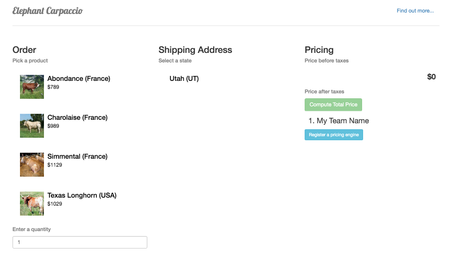

# Elephant Carpaccio - sample pricing engine in nodejs
## Introduction
Incremental development is an important habit of the Agile Mindset.

[Alistair Cockburn](https://en.wikipedia.org/wiki/Alistair_Cockburn) created the [Elephant Carpaccio Exercise](http://alistair.cockburn.us/Elephant+Carpaccio+Exercise) to help coders and product owners get into the mood.

## The Situation
To enter the exercise, imagine the following context.

A small startup is in the business of selling meat online. So far, they purchased a web application allowing customers to select a product and a quantity to purchase, **The Store**.

The founders' business plan foresees to roll out the application to several states in the US. All they need is a service able to calculate taxes depending on the state of delivery, **The Pricing Engine**. They will hire a contractor to deliver that service.

This is where the exercise begins. Participating teams play the role of those contractors. The startup is short on budget, so you better help them earn money quickly ...

We are aiming for a _Self-funding project_. Slicing the problem in thin vertical slices to laminate the solution is the approach agile organizations take, and it allows for [Design by Knowledge Acquisition](http://alistair.cockburn.us/Design+as+Knowledge+Acquisition) and [Disciplined Learning](http://alistair.cockburn.us/Disciplined+Learning).

## The Pricing Engine
- This repository implements an empty pricing engine.
- It provides a starting point for the exercise.
- It displays the engine specification and a simple user interface to submit values to the engine.

## Deploying the pricing engine on Bluemix
In this section, you learn how to do the following:
- create your Bluemix account,
- deploy an empty pricing engine written in nodejs,
- use Bluemix DevOps web editor to modify the engine implementation,
- deploy your changes,
- connect your pricing engine to the main store.


1. Go to [ibm.com/bluemix](http://ibm.com/bluemix) and click **Sign Up**.

  

2. Fill in the sign-up form and click **Create account**.

  

3. Wait for the activation link in your emails.

  

4. Go to [ibm.com/bluemix](http://ibm.com/bluemix) and Log in.

  

  After you log in, the Bluemix console displays on the dashboard:  

  

5. Click the deploy button below:

  <a href="https://bluemix.net/deploy?repository=https://github.com/l2fprod/carpaccio-pricing" target="_blank"></a>

6. Click **Log In** to connect to Bluemix DevOps.

  

7. If you never connected to Bluemix DevOps before, you will be prompted to define an alias to be used by DevOps services.

  

  

8. From here you will be taken to a page where you will be prompted to name your pricing engine. A sample name is provided for you, but feel free to give your application any name you like. If the name is already used by another user, you will be prompted to try another name. Also select a region, an organization and a space where to deploy the application.

  

9. Once you have named your application, click the **Deploy** button to begin the deploy process to IBM Bluemix. During this process, IBM Bluemix automatically builds and deploys your application based on the GitHub repository.

  

10. Once the application has finished deploying, you see a **Success!** message.

  

  The process has created a new private DevOps Services project and a git clone of the lab source code repository, built your application and deployed it to IBM Bluemix. In addition, it configured a Build & Deploy pipeline that will get triggered whenever your commit changes to the Git repository.

11. Click **View Your App** to access the deployed application.

  

12. We are now going to perform changes to the running application. Go back to the "Deploy to Bluemix" page and click **Edit Code**.

  

13. The Web Editor displaus on your app:

  

  The web editor allows you to modify and commit changes to the project without leaving your web browser.

  It comes with a **Live Edit** feature that allows you to make changes to the running app without having to commit these changes to the code of the Git repository. We will enable and use this feature in the next steps to accelerate the round trip between changing the code and viewing the impact of the change on the deployed app.

14. Click the switch to enable **Live Edit**.

  

15. Click **OK** when prompted.

  

16. Wait until **Live Edit** is enabled for the app. Notice the indicator near the project name shows the status of enabling Live Edit for your app.

  

17. After a short while, the project indicator becomes green again. **Live Edit** is enabled.

  

18. Open the **app.js** file. It contains the pricing engine implementation.

  

19. Line 23 shows the implementation of the /pricing endpoint. Currently it returns a 501 error code (Not Implemented).

  

20. To illustrate the **Live Edit** feature, let's modify the implementation. Instead of simply returning the error code, we will also add a message:

  The new code reads as:

  ```
  res.status(501).send({error: "this is not implemented"})
  ```

  Once modified, save your work and click the "Restart the App Without Redeploying" button

  

21. Let's do another change. This time we show a dummy implementation that returns 0 as the totalPrice for the transaction:

  ```
  res.send({totalPrice: 0})
  ```

  

  Once modified, save the file and click the "Restart the App Without Redeploying" button.

22. Test the change in your app.

  

  At this point, you are equipped to make quick changes to your app and to have them taken into account by the store.

### Registering your pricing engine with the store

1. Obtain the store location from the organizer.

2. Go to the store homepage, scroll down and click **Register a pricing engine**.

  

24. Enter your engine information and click **Register**.

  

  Your engine name will appear in the list of registered pricing engine. You're done!
  
  

### Committing changes to the main repository

All the changes you made so far are local to the web editor and have not been committed to the Git repository for your project.
1. To commit the changes made in the web editor, switch to the **Git** view.

  

2. Select the changes to commit.

  

3. Type a message and click **Commit**.

  

4. To push the changes from the web editor Git repository to the master Git repository, click the **Sync** button.

  

    

  

## Running the pricing engine on Bluemix
Follow the steps below to use your local development environment to develop and deploy your application.
1. Create a Bluemix Account.

   [Sign up][bluemix_signup_url] for Bluemix, or use an existing account.

2. Download and install the [Cloud-foundry CLI][cloud_foundry_url] tool.
3. Clone the app to your local environment from your terminal using the following command:

  ```
  git clone https://github.com/l2fprod/carpaccio-pricing.git
  ```

4. Change your path (cd) into this newly created directory.
5. Edit the `manifest.yml` file and change the `<application-name>` and `<application-host>` from `carpaccio-pricing` to something unique.

  ```
   applications:
   - name: carpaccio-pricing
     host: carpaccio-pricing
     memory: 256M
  ```

  The host you use will determinate your application url, e.g. `<application-host>.mybluemix.net`.

6. Connect to Bluemix in the command line tool and follow the prompts to log in.

  ```
   $ cf api https://api.ng.bluemix.net
   $ cf login
  ```

7. Push the application to Bluemix.

  ```
  $ cf push
  ```

And voila! You now have your very own instance running on Bluemix. Navigate to the application url, e.g. `<application-host>.mybluemix.net`.

### Troubleshooting
To troubleshoot your Bluemix app, the main useful source of information is the logs. To see them, run:

```sh
  $ cf logs <application-name> --recent
```

--------------------------------------------------------------------------------

This sample application is created for the purpose of supporting the exercise. The program is provided as-is with no warranties of any kind, express or implied.

[bluemix_signup_url]: https://console.ng.bluemix.net/?cm_mmc=GitHubReadMe-_-BluemixSampleApp-_-Node-_-Workflow
[cloud_foundry_url]: https://github.com/cloudfoundry/cli